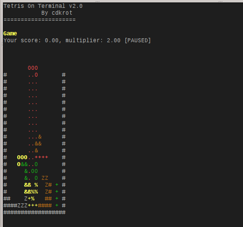
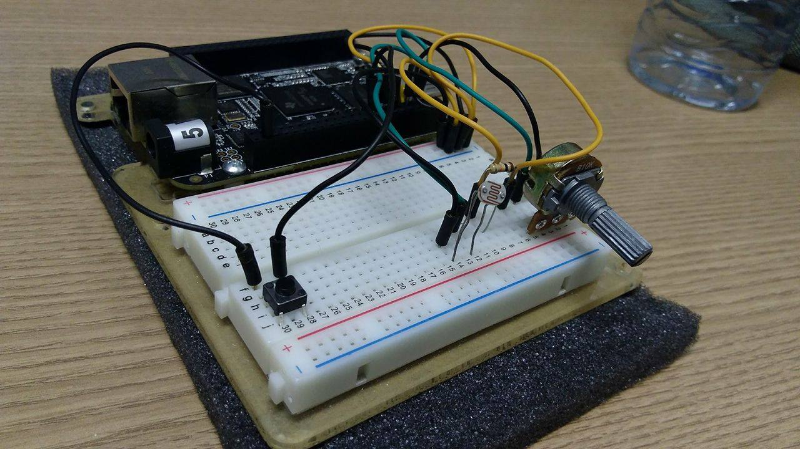

## Objective: To explore theoretical and practical aspects of sockets, modifying a Tetris game.

#### Actual game: ./tcp-controlled-game (more info. about it there)

#### Joystick: ./tcp-controller (more info. about it there)

### Description:

In the previous project,  [Tetris-On-Terminal-BeagleBone-Version](https://github.com/pentalpha/tetris-on-terminal-Beaglebone-Version-), we explored the use of GPIO and ADC on the BeagleBoneBlack, using threads and priorities. A joystick as implemented for a game running on the BBB. Now, the idea is to add new features, such as socket communication.

- 1.1 The project has 2 programs, a client and a server;

- 1.2 One is the game (server) and the other one, the joystick (client);

- 2. Sockets: The communication between the programs, running on different machines, uses TCP sockets;

- 3. The joystick uses Python 2, while the game is made in C++ and uses a class for sockets made in C++11;

- 4. Threads are used both in the joystick and game to manage the communication. In the joystick, they are also used to read data from the analogic inputs;
